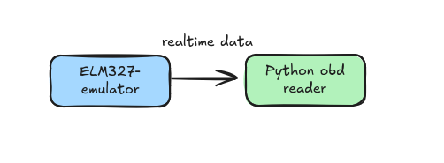

# obd-simulation-python-nixtla-gpt

What is OBD?
[Reference](https://www.obdtester.com/obd2_hobby)
```
All vehicles manufactured after 1996 (for US) or 2000 (for EU) must contain an On Board Diagnostic (OBD) connector
and OBD compliat engine Electronic Control Unit (ECU) that provides diagnostic information about engine status, faults and monitors how engine works.

The data provided by the OBD II diagnostic system were originally intended to monitor the engine's emissions and track down problems that
caused cars to pollute more than normal. Today, however, manufacturers have extended the standard to contain a great deal of data about
other problems and performance. OBD II data is what causes your car's "check engine" light to go on when there is a problem, and it
is likely your mechanic's tool when you bring the car in with symptoms that have no obvious cause.

Since the data's transmission format and content are standardized, a number of tools have been developed to read information
via OBD-II connector.
```



[ELM327-emulator](https://github.com/Ircama/ELM327-emulator) - `A Python emulator of the ELM327 OBD-II adapter connected to a vehicle supporting multi-ECU simulation.`

[Python-OBD](https://python-obd.readthedocs.io/en/latest/) - `Python-OBD is a library for handling data from a car's On-Board Diagnostics port (OBD-II). It can stream real time sensor data, perform diagnostics (such as reading check-engine codes), and is fit for the Raspberry Pi. This library is designed to work with standard ELM327 OBD-II adapters.`

```bash
python3 -m venv .venv
. .venv/bin/activate
pip install -r requirements.txt
```

```bash
# On one terminal start a simulator to emulate data for the preconfigured set of OBD service requests of a Toyota Auris Hybrid car.
python3 -m elm -s car

# This will share a dev endpoint which can be connected from any OBD protocol understanding application.
# Similar to following: /dev/pts/1
```

```bash
# Once above is setup, in another terminal we will run the script to process the data from this device endpoint.
# Remember to change your device pointer number in the script before running.
# This collects various data points from this car simulator and saves the data in a csv on a per second basis.
# The generated csv can then be processed using the ipynb file provided in the repo.
python data_connector.py
```
